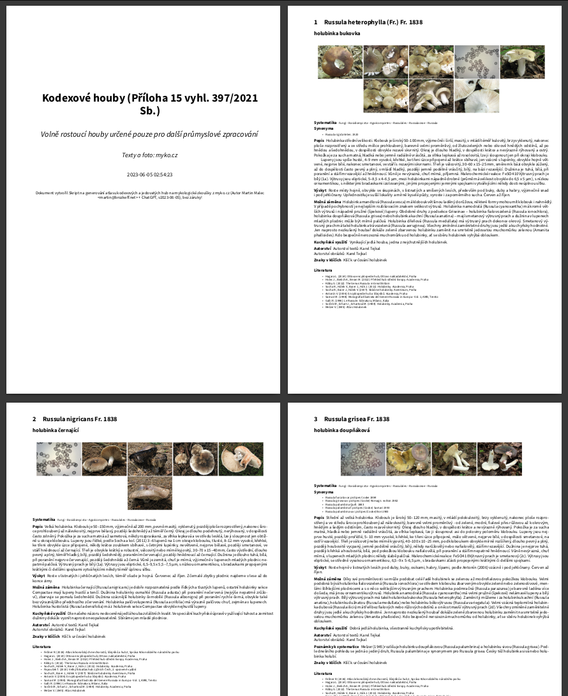

# Skript na generování atlasu kodexových a jedovatých hub na mykologické zkoušky z myko.cz

**Autor:** Martin Malec + ChatGPT

**Popis:** Stahuje dle seznamů kodexových a jedovatých hub (mushrooms1-mushrooms3.txt) zkopírovaných z vlastních výpisků na Dokuwiki <https://wiki.brozkeff.net/misc/mykologicka-zkouska-2023> HTML soubory z webu České mykologické společnosti (myko.cz) společně s fotkami hub, sází je do LaTeXu, slepí dohromady za sebe a vytvoří tiskové PDF. Používá XeLaTeX pro podporu UTF-8, libovolných systémových fontů atd.

**Závislosti Python3:**

```python
import requests
from bs4 import BeautifulSoup
import urllib.parse
import os
from slugify import slugify
import re
import argparse
import datetime
import latexcodec
```

**Další závislosti:**
LaTeX, XeTeX a řada balíčků, na které odkazuje master.tex + font zvolený při spuštění skriptu (výchozí Source Sans Pro):

```tex
\documentclass[a4paper]{article}
\usepackage{graphicx}
\usepackage{geometry}
\usepackage{fontspec}
\usepackage{polyglossia}
\usepackage{setspace}
\usepackage{fontsize}
\usepackage{etoolbox}
\usepackage{titlesec}
```

Možná další nezkoumané závislosti. Testováno na Linux Mint 21 (Ubuntu 22.04) se spoustou balíků. *"It works for me"*.

**Podrobnější popis:** Skript je polomanuální.

* Nejdřív se ze seznamu pár vyzkoušených fontů zeptá na to, v jakém fontu celé atlasy vysázet.
* Pak se zeptá, jakou kategorii atlasu hub generovat pro vytvoření titulní strany s názvem:
  * (a) Kodexové houby dle Přílohy 15 vyhl. 397/2021 Sb. volně rostoucí nebo
  * (b) volně rostoucí pro průmyslové zpracování, nebo
  * (c) Rozlišované jedovaté houby dle §3 odst. 1 a Přílohy 2 vyhlášky 475/2002 Sb.
* Těmto skupinám odpovídají předpřipravené seznamy v DokuWiki formátu v souborech `mushrooms1-jedle.txt`, `mushrooms2-prumyslove.txt` resp. `mushrooms3-jedovate.txt`.
  * Volbu který soubor použít je nutné zvolit ručně aby odpovídal předtím zvolené titulní straně.
* Pro první vygenerování dílčích .tex souborů jednotlivých hub skript stahuje HTML stránek z myko.cz, které parsuje a krom toho stahuje i obrázky v .jpg formátu, co ještě neexistují ve složce `images/`.
* Malé piktogramy v .bmp formátu skript ignoruje.
* Opětovné stahování a parsování HTML stránek do .tex souborů ve složce `tex/` lze přeskočit pokud už jsou všechny tyto .tex soubory správně vygenerované a je snahou jen vysázet celý dokument např. pomocí jiného fontu.
* Nakonec se vytvoří master .tex soubor co určuje celkový vzhled sazby, velikost a typ fontu, začíná titulní stranou s názvem a pak vkládá za sebe všechny jednotlivé .tex soubory hub.
* Tento .tex soubor je pak vysázen pomocí XeLaTeX do PDF (s ohledem na různé chyby v .tex souborech může být nutné xelatexu odklepnout drobné chyby, nebo manuálně některé .tex soubory opravit.
* Nakonec je PDF přejmenováno dle na začátku zvolené kategorie hub.

**Upozornění:** Skript je narychlo zbastlený v Pythonu3 vytvořený z větší části s asistencí ChatGPT. Není naprogramovaný hezky, ani objektově, proměnné jsou pojmenované všelikak, kód je špagetový, ale nějak fungoval na jednorázové vygenerování "atlasů hub" z webu myko.cz

## Screenshot z vygenerovaného PDF



## Licence

**Licence skriptu:** MIT License

**Varování:** texty a fotky z myko.cz jsou předmětem běžného copyrightu a distribuce hotových .tex souborů, .jpg fotek i vysázených atlasů v .pdf by patrně vyžadovala souhlas vlastníků práv k podkladům, které tento skript stahuje!
